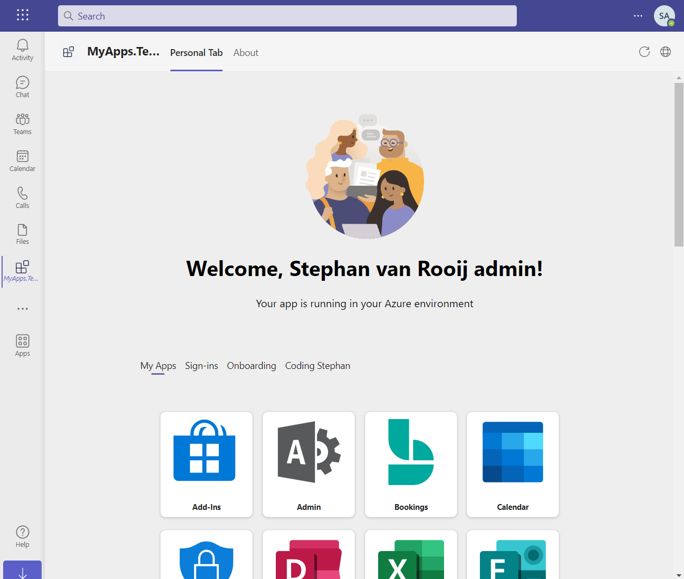
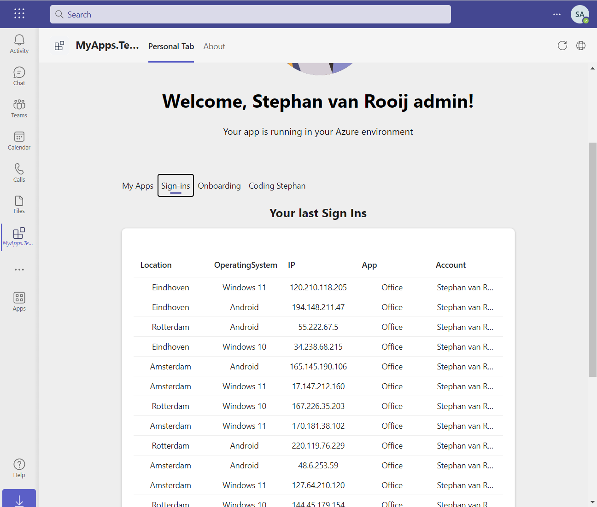
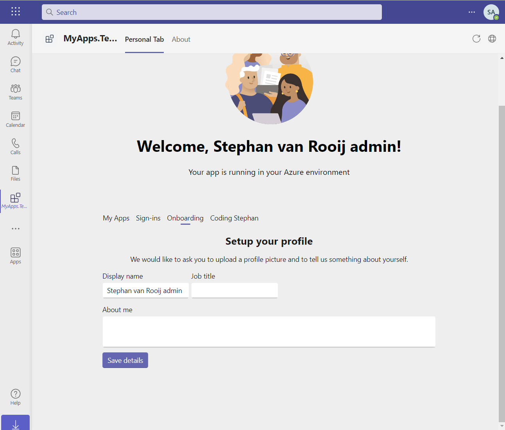
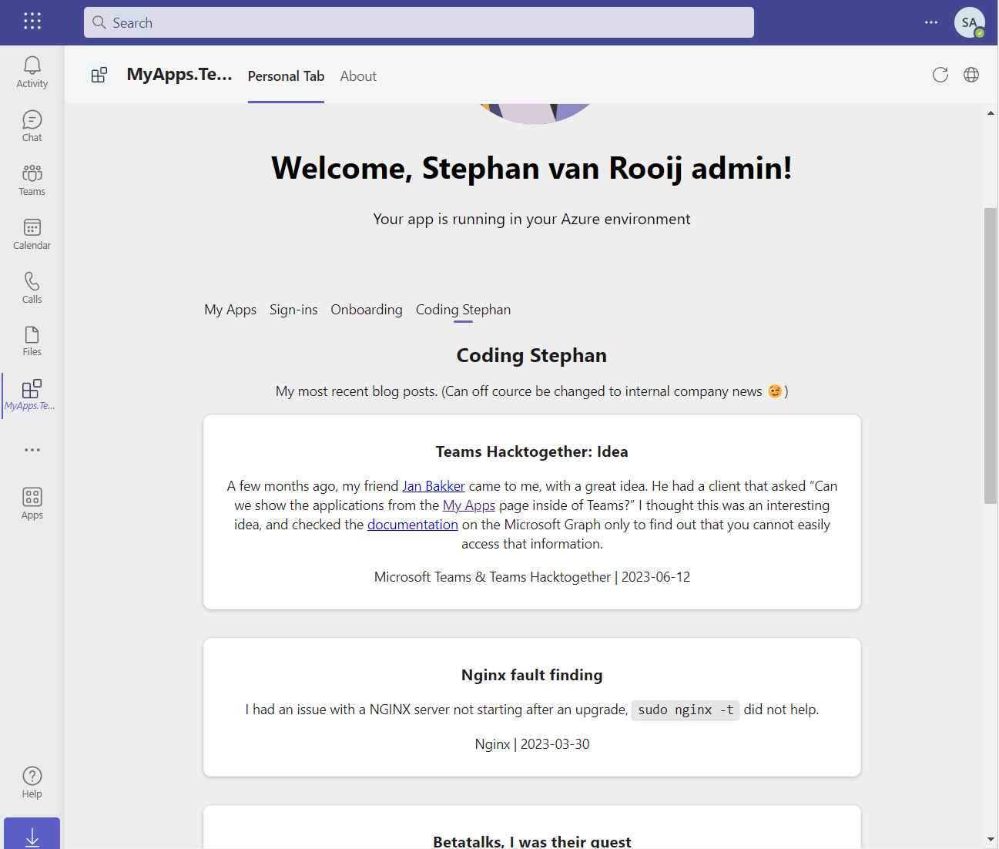

# My apps in Teams

We had a blast building our application for the [Teams Hacktogether](https://github.com/microsoft/hack-together-teams).

This app is by no means ready for production!

## What this is

- A learning experience in building a Teams app in **Blazor**.
- A fun experiment.
- A collaboration between friends ([@svrooij](https://github.com/svrooij) and [@janbakker](https://github.com/BakkerJan)).
- A sample on how to access data normally unaccessible.
- A question for some new Graph endpoints (`/me/siginins` anyone?)
- A participant in the hackathon.

## What this is not

- A app you should use in production.
- A fully supported Teams app (but you can always contact one of us if you want something similar for your company)
- A winner in the hackathon.

## Features

We had an [idea](https://svrooij.io/2023/06/12/teams-hacktogether-idea/) as a starting point, then we build some more.

### My Apps in Teams

The [idea](https://svrooij.io/2023/06/12/teams-hacktogether-idea/) was to build an app that would show all apps from the **My Apps** page into Teams. So that is what we did, there is no *public* endpoint to get the information from the Graph API, but more on that later (follow the Idea page for more updates).

### My Signin logs

Sign-ins would be a nice extra feature, we could not get them from the Graph API without getting admin consent. Reading signin logs [requires](https://learn.microsoft.com/graph/api/signin-list?view=graph-rest-1.0&tabs=http#permissions) some serious permissions. And we would like to request a new endpoint with less permissions just to access the signin logs for the current user. Something like `/me/signins`.

### Onboarding

**Being worked on**, we are also adding an onboarding flow where we allow the user to add addition data to his profile. This could be useful if you have new employees and you want everybody to be findable by others.

### Blog

Once we got the hang of it we decided that we might also add some blog to the mix. [svrooij.io](https://svrooij.io) was a good candidate. You can see the 5 latest posts right inside Teams.

## Journey

We are planning a blog series on the topic.

- [Teams Hacktogether Idea](https://svrooij.io/2023/06/12/teams-hacktogether-idea/)
